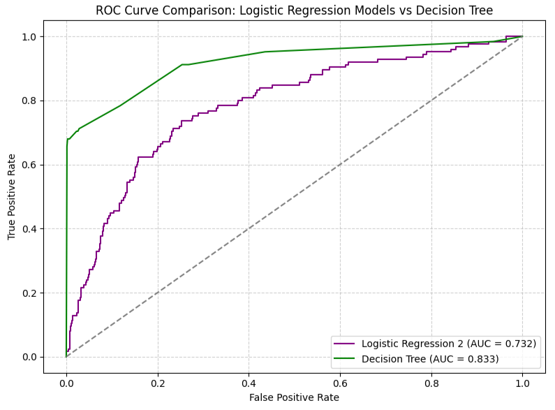
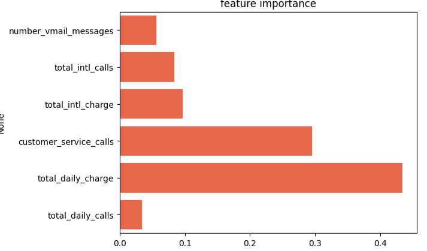

# Project Problem Overview

## **SyriaTel**, a leading telecommunications provider, is seeking a predictive solution to help reduce customer churn. The company has tasked me with developing a model that can accurately forecast whether a customer is likely to stay with the service or leave. By identifying patterns in customer behavior, this model will enable SyriaTel to take proactive measures to retain valuable customers and minimize revenue loss due to churn.
--- 
## Key Objectives
#### The following are the key project objectives:
#### 1. Identify the most effective model for accurately predicting customer churn.
#### 2. Determine the key features that significantly influence a customer’s decision to remain with or leave SyriaTel.

#### Libraries used on this project
```python 
import pandas as pd
import numpy as np
import matplotlib.pyplot as plt
from sklearn.linear_model import LogisticRegression
from sklearn.model_selection import train_test_split
from sklearn.metrics import roc_curve, auc
from sklearn.metrics import accuracy_score, classification_report, roc_auc_score, recall_score, precision_score
from imblearn.over_sampling import SMOTE
from sklearn.preprocessing import StandardScaler
from sklearn.tree import DecisionTreeClassifier
import seaborn as sns
```
--- 
### Data Cleaning Processes implemented include:
#### 1. Checked for Null values
```python 
# look for missing values in all the columns
telecomdf1.isna().sum()
```
#### Output shows no missing values

#### 2. Assess whether there a duplicate values
```python 
# checking for duplicate values
telecomdf1.duplicated().sum()
```
#### Output shows no duplicate values
#### 3. Removed white noise on the column names
```python 
# Remove the white noise in the column names. Replace space with underscore
telecomdf1.columns = telecomdf1.columns.str.replace(" ", "_")
```

#### 4. Select only numerical predictors

```python 
# seperate the dataset into train and test dataset
X = telecomdf.drop(columns = "churn")
y = telecomdf["churn"]
# Split the data into train and test dataset
x1_train, x1_test, y1_train, y1_test = train_test_split(X, y, test_size = 0.25, random_state = 42)
y1_train.value_counts() 

```
--- 
## Classification models
### **Logistic Regression**
#### Steps taken include

#### Step 1: 
Split the dataset into train and test

```python 
# Separate the dataset into train and test dataset
X = telecomdf.drop(columns = "churn")
y = telecomdf["churn"]
# Split the data into train and test dataset
x1_train, x1_test, y1_train, y1_test = train_test_split(X, y, test_size = 0.25, random_state = 42)
y1_train.value_counts() 
```
#### Step 2:
Train the models and then using the trained model, predict the target
```python
# Instantiate the model
Lr = LogisticRegression(max_iter = 1000, random_state = 42)
# fit the model
Lr.fit(x1_train, y1_train)

# make prediction 
y_pred1 = Lr.predict(x1_test)

```
#### Step 3:
Evaluate the model using the classification metrics

```python
# Evaluate the model performance using precision, F1 -Score, Accuracy and AUC 
accuracy = accuracy_score(y1_test, y_pred1)*100
precision = precision_score(y1_test, y_pred1)*100
recall = recall_score(y1_test, y_pred1)*100
auc = roc_auc_score(y1_test, y_pred1)*100

print(f"Accuracy: {accuracy:.2f}")
print(f"Precision: {precision:.2f}")
print(f"Recall: {recall:.2f}")
print(f"AUC: {auc:.2f}")

# Output
Accuracy: 85.73
Precision: 66.67
Recall: 9.60
AUC: 54.38
```

#### Step 4:
Perform feature engineering, correct multicollinearity, preprocessing (standardization) and correct class imbalance to try improve the model perform
```python
# Combine  the total day, night and evening charge into one column
# Combine  the total day, night and evening minutes into one column
# Combine  the total day, night and evening calls into one column
telecomdf2["total_daily_charge"] = telecomdf2["total_day_charge"]+ telecomdf2["total_eve_charge"] + telecomdf2["total_night_charge"]
telecomdf2["total_daily_minutes"] = telecomdf2["total_day_minutes"]+ telecomdf2["total_eve_minutes"] + telecomdf2["total_night_minutes"]
telecomdf2["total_daily_calls"] = telecomdf2["total_eve_calls"]+ telecomdf2["total_night_calls"] + telecomdf2["total_day_calls"]


# delete columns that have been used in the above cell to feature engineer as well as account _length and Area_code which cannot be used to predict the  mode
del telecomdf2["total_day_charge"]
del telecomdf2["total_day_calls"]
del telecomdf2["total_day_minutes"]
del telecomdf2["total_eve_charge"]
del telecomdf2["total_eve_calls"]
del telecomdf2["total_eve_minutes"]
del telecomdf2["total_night_charge"]
del telecomdf2["total_night_calls"]
del telecomdf2["total_night_minutes"]
del telecomdf2["account_length"]
del telecomdf2["area_code"]

# check for multicollinearity btn the independent variables excluding the label = churn. We check  for features that have a correlation greater than 0.8
# Select only feature columns
features = telecomdf2.drop(columns=['churn'])

# Compute absolute correlation matrix
corr_matrix = features.corr().abs()

# Keep only upper triangle (to avoid duplicate pairs)
upper = corr_matrix.where(np.triu(np.ones(corr_matrix.shape), k=1).astype(bool))

# Find feature pairs with correlation > 0.8
high_corr = [(column, row, upper.loc[row, column]) 
             for column in upper.columns 
             for row in upper.index 
             if upper.loc[row, column] > 0.8]

print("Highly correlated feature pairs (|corr| > 0.8):")
for pair in high_corr:
    print(pair)
```
#### Output:
#### Highly correlated feature pairs (|corr| > 0.8):
#### ('total_intl_charge', 'total_intl_minutes', np.float64(0.9999927417510314))
#### ('total_daily_minutes', 'total_daily_charge', np.float64(0.8916739057231682))

```python
Feature Scaling: standardization 

# instantiate the StandardScaler
scaler = StandardScaler()
# features to standardize
cols_to_scale = ['number_vmail_messages', 'total_intl_calls', 'total_intl_charge',
                 'customer_service_calls', 'total_daily_charge', 'total_daily_calls']

# Fit and transform the selected columns, then save back to DataFrame
telecomdf2[cols_to_scale] = scaler.fit_transform(telecomdf2[cols_to_scale])
## Check for class imbalance on the target variable (churn)
valueCount = telecomdf2["churn"].value_counts(normalize = True) * 100
valueCount 
## from the output below, we note that there are 85.50% Nos and 14.49% yes. This shows high imbalance which can lead to model being biased.
## To sort this out, we need to implement SMOTE Method after splitting the dataset into train and test dataset
```
#### Output:
#### churn
#### 0    85.508551
#### 1    14.491449

### Step 4: 
Train and use the model to make prediction
```python
# separate the x and y values
X = telecomdf2.drop(columns = ["churn"])
y = telecomdf2["churn"]

# Split the data into trainng and testing dataset
x2_train, x2_test, y2_train, y2_test = train_test_split(X, y, test_size = 0.25, random_state = 42)

# verify whether the class imbalance still stands on the train dataset
imbalance = y2_train.value_counts(normalize = True) * 100
imbalance
# from the output below, we noted that we have class imbalance still remains the same even for the target train dataset
#### 2. **Decision Tree**

```
#### Output
#### churn
#### 0    85.67427
#### 1    14.32573
#### Name: proportion, dtype: float64

#### Step 5:
Class imbalance - SMOTE
```python
# Therefore, we need to use the SMOTE method to rectify the class imbalance on the train dataset
# instantiate the SMOTE
sm = SMOTE(random_state = 42)

# perform the SMOTE on the train dataset
xsmote2_train, ysmote2_train = sm.fit_resample(x2_train, y2_train)

# instantiate the logistic regression model
Lr2 = LogisticRegression(solver = "lbfgs", max_iter = 1000)

# Train the linear regression model using the above resampled values
Lr2.fit(xsmote2_train, ysmote2_train)

# Using the trained model above, predict the y test
y2_pred = Lr2.predict(x2_test)

```
#### Step 6: 
Test the model performance
```python
# Test the model performance
accuracy = accuracy_score(y2_test, y2_pred)*100
precision = precision_score(y2_test, y2_pred)*100
recall = recall_score(y2_test, y2_pred)*100
auc = roc_auc_score(y2_test, y2_pred)*100

print(f"Accuracy: {accuracy:.2f}%")
print(f"Precision: {precision:.2f}%")
print(f"Recall: {recall:.2f}%")
print(f"AUC: {auc:.2f}%")
```
#### Output
#### Accuracy: 71.82%
#### Precision: 31.54%
#### Recall: 75.20%
#### AUC: 73.21%

#### **Logistic Regression Conclusion: Model Performance Summary** 

#### The initial logistic regression model achieved an accuracy of 85.7%, but its recall (9.6%) and AUC (0.54) were very low. This indicates that, although the model correctly predicted most non-churn cases, it failed to identify the majority of actual churners — making it ineffective for churn prediction.
#### After making changes to the dataset, the updated model’s accuracy decreased to 71.8%, but recall improved significantly to 75.2% and AUC increased to 0.73. This shows that the model is now much better at distinguishing between churners and non-churners, even though it makes more false positive predictions (as seen from the lower precision of 0.32).Overall, the second model performs better because it achieves a stronger balance between correctly identifying churners and overall classification ability

### **Decision Tree**

#### Steps taken include:
#### Step 1:
Train and use the model to make prediction
```python
# specify both the y and x values
X = telecomdf3.drop(columns = ["churn"])
y = telecomdf3["churn"]

# split the data into train and split dataset
x3_train, x3_test, y3_train, y3_test = train_test_split(X, y, test_size = 0.25, random_state = 42)

# Instantiate the decision tree and include class_weight to balance the 
tree = DecisionTreeClassifier(class_weight='balanced', random_state = 42)

# train the model
tree.fit(x3_train, y3_train)

# Predict the model
y3_pred = tree.predict(x3_test)
```
#### Step 2:
Test the model performance
```python
accuracy = accuracy_score(y3_test, y3_pred)*100
precision = precision_score(y3_test, y3_pred)*100
recall = recall_score(y3_test, y3_pred)*100
auc = roc_auc_score(y3_test, y3_pred)*100

print(f"Accuracy: {accuracy:.2f}%")
print(f"Precision: {precision:.2f}%")
print(f"Recall: {recall:.2f}%")
print(f"AUC: {auc:.2f}%")
```
#### Output:
#### Accuracy: 91.85%
#### Recall: 73.60%
#### AUC: 84.33%

#### Step 4: 
Check for overfitting and Underfitting
```python
# Test the model performance
accuracy = accuracy_score(y3_test, y3_pred)*100
precision = precision_score(y3_test, y3_pred)*100
recall = recall_score(y3_test, y3_pred)*100
auc = roc_auc_score(y3_test, y3_pred)*100

print(f"Accuracy: {accuracy:.2f}%")
print(f"Precision: {precision:.2f}%")
print(f"Recall: {recall:.2f}%")
print(f"AUC: {auc:.2f}%")

```
#### Output
#### Accuracy: 86.69%
#### Precision: 53.85%
#### Recall: 78.40%
#### AUC: 83.28%

#### Step 5: 
Evaluate whether overfitting has reduced
```python
train_acc1 = tree.score(x3_train, y3_train)
test_acc1 = tree.score(x3_test, y3_test)

if train_acc > test_acc:
    print(f"overfitting: train_acc:{train_acc1:.2f} and test_acc:{test_acc1:.2f}")
elif train_acc < test_acc:
    print(f"underfitting: train_acc:{train_acc1:.2f} and test_acc:{test_acc1:.2f}")

# We note that the difference between train_acc1 and train_acc2 has reduced to 2% which is okay
```

#### We plot the AUC curve to compare which model performed best


#### Conclusion:
#### 1. Based on the ROC curve above, decision tree is the best model since it has the hightest AUC
#### 2. Based on the feature importance done on the decision tree model we noted the following:
#### The analysis shows that total_daily_charge is the most important predictor of customer churn, followed by customer_service_calls. This indicates that customers with higher daily charges or frequent service calls are more likely to leave the company. Other variables such as total_intl_charge, total_intl_calls, and number_vmail_messages contribute moderately, while total_daily_calls has minimal impact. Overall, spending behavior and customer service interactions are the strongest indicators of churn


